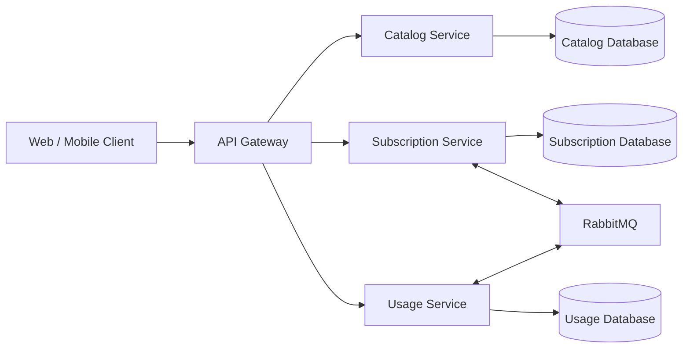

# StreamAdminApp


> Plataforma para gerenciamento centralizado de assinaturas de serviços de streaming, permitindo acompanhar planos, custos, utilização e oportunidades de economia.


---

## 📖 Sobre o projeto

O **StreamAdmin** é uma aplicação criada para centralizar o gerenciamento de assinaturas de serviços de streaming.

A proposta surgiu a partir de um problema simples: conforme a quantidade de serviços assinados aumenta, torna-se cada vez mais difícil acompanhar:

* quais serviços estão ativos;
* quais planos estão sendo utilizados;
* quanto está sendo gasto mensalmente;
* quando cada assinatura será renovada;
* quais serviços estão sendo pouco utilizados;
* quanto poderia ser economizado ao cancelar, pausar ou trocar determinados planos.

A aplicação pretende transformar essas informações em uma visão consolidada sobre os serviços digitais consumidos pelo usuário.

Além do objetivo funcional, o StreamAdmin também é utilizado como ambiente para estudo e aplicação prática de conceitos relacionados a **arquitetura de software, microsserviços, APIs REST, mensageria, persistência de dados, testes automatizados e sistemas distribuídos utilizando .NET**.

---

# 🎯 Objetivos

O StreamAdmin pretende permitir que o usuário:

* cadastre suas assinaturas;
* selecione plataformas previamente cadastradas no catálogo;
* selecione planos disponíveis para determinada plataforma;
* informe o valor efetivamente pago pela assinatura;
* acompanhe datas de início e renovação;
* acompanhe assinaturas ativas, pausadas ou canceladas;
* registre ou acompanhe utilização dos serviços;
* visualize seus gastos mensais;
* identifique serviços pouco utilizados;
* compare custo e utilização;
* receba alertas relacionados a renovações;
* identifique oportunidades de economia.

A longo prazo, a intenção é que a aplicação consiga responder perguntas como:

> Quanto gasto atualmente com streaming?

> Quais serviços representam a maior parte dos meus gastos?

> Estou pagando por algum serviço que praticamente não utilizo?

> Quanto eu economizaria suspendendo determinadas assinaturas?

> Qual serviço apresenta melhor relação entre custo e utilização?

---

# 💡 Motivação

Hoje é comum que uma única pessoa mantenha assinaturas simultâneas de diferentes plataformas:

* Netflix
* Amazon Prime Video
* Disney+
* Max
* Spotify
* YouTube Premium
* Apple TV+
* serviços especializados
* entre outros

Normalmente essas informações ficam distribuídas entre aplicativos, cartões de crédito, e-mails e contas individuais.

O **StreamAdmin** busca funcionar como uma camada central de gerenciamento dessas assinaturas.

---

# 🏗️ Arquitetura

O projeto está sendo desenvolvido seguindo uma arquitetura baseada em **microsserviços**.

Cada serviço é responsável por uma parte específica do domínio e possui autonomia para evoluir de maneira independente.



> A arquitetura apresentada representa a direção planejada para o projeto. Alguns componentes ainda estão em desenvolvimento ou fazem parte do roadmap.

---

<!-- # 🧩 Microsserviços

## 📚 Catalog Service

Responsável por manter o catálogo de plataformas e planos disponíveis no sistema.

Ao invés de exigir que cada usuário cadastre manualmente informações como:

> Netflix → Premium → 4K → 4 telas

o catálogo mantém essas informações previamente estruturadas.

Isso permite que outros serviços utilizem uma fonte padronizada de informações.

### Principais responsabilidades

* cadastrar plataformas;
* editar plataformas;
* consultar plataformas;
* ativar/desativar plataformas;
* cadastrar planos;
* associar planos às plataformas;
* manter características dos planos;
* disponibilizar informações para outros microsserviços.

Exemplo:

```text
Netflix
│
├── Padrão com anúncios
├── Padrão
└── Premium
```

Cada plano pode possuir informações como:

* nome;
* descrição;
* preço de referência;
* moeda;
* quantidade máxima de telas;
* resolução máxima;
* presença de anúncios;
* suporte a downloads;
* situação do plano.

---

## 💳 Subscription Service

Responsável pelo gerenciamento das assinaturas pertencentes aos usuários.

Diferentemente do catálogo, que representa informações gerais sobre uma plataforma, o Subscription Service representa **a assinatura real realizada pelo usuário**.

Exemplo:

```text
Plataforma: Netflix
Plano: Premium
Valor de referência: R$ 59,90
Valor pago pelo usuário: R$ 44,90
Renovação: dia 15
Status: Ativa
```

### Responsabilidades planejadas

* criar assinatura;
* alterar assinatura;
* cancelar assinatura;
* pausar assinatura;
* reativar assinatura;
* informar valor efetivamente pago;
* registrar data inicial;
* registrar data de renovação;
* acompanhar situação da assinatura.

---

## 📊 Usage Service

Responsável por registrar e analisar a utilização dos serviços assinados.

A intenção é possibilitar análises que relacionem **custo e utilização**.

Exemplo:

```text
Netflix
Valor mensal: R$ 44,90
Utilização no mês: 22 horas
Custo aproximado por hora: R$ 2,04
```

### Responsabilidades planejadas

* registrar utilização;
* armazenar histórico de consumo;
* consolidar utilização mensal;
* calcular indicadores;
* fornecer dados para análises financeiras;
* identificar serviços pouco utilizados.

---

# 🗃️ Modelo inicial do domínio

Atualmente, o desenvolvimento está concentrado principalmente no **Catalog Service**.

Entre as principais entidades encontram-se:

## StreamingPlatform

Representa uma plataforma disponível no catálogo.

```text
StreamingPlatform
├── Id
├── Name
├── Description
├── WebSiteUrl
├── IsActive
└── Plans
```

Uma plataforma pode possuir diversos planos.

---

## StreamingPlan

Representa um plano pertencente a uma determinada plataforma.

```text
StreamingPlan
├── Id
├── StreamingPlatformId
├── Name
├── Description
├── ReferencePrice
├── Currency
├── MaximumScreens
├── MaximumResolution
├── HasAds
├── AllowsDownloads
└── IsActive
```

A relação principal é:

```text
StreamingPlatform 1 ─────────── N StreamingPlan
```

Ou seja:

> Uma plataforma pode possuir vários planos, enquanto cada plano pertence a uma única plataforma.

--- -->

# 🛠️ Tecnologias

O projeto utiliza ou pretende utilizar as seguintes tecnologias:

### Backend

* C#
* .NET
* ASP.NET Core
* ASP.NET Core Web API
* Entity Framework Core
* LINQ
* Dependency Injection
* AutoMapper

### Persistência

* Banco de dados relacional
* Entity Framework Core
* Migrations

### Comunicação entre serviços

* REST
* RabbitMQ
* comunicação assíncrona baseada em eventos

### Infraestrutura

* Docker
* Docker Compose

### Qualidade

* testes unitários;
* testes de integração;
* validação de regras de negócio;
* separação de responsabilidades;
* boas práticas de desenvolvimento orientado a objetos.

---

<!-- # 🔄 Comunicação entre microsserviços

Nem toda comunicação dentro do StreamAdmin precisa ocorrer de maneira síncrona.

Operações que exigem uma resposta imediata podem utilizar HTTP/REST.

Exemplo:

```text
Subscription Service
        |
        | GET /platforms/{id}
        v
Catalog Service
```

Entretanto, eventos de domínio poderão ser distribuídos de maneira assíncrona através do **RabbitMQ**.

Exemplo:

```text
SubscriptionCancelled
        |
        v
     RabbitMQ
        |
        +--------------------+
        |                    |
        v                    v
Usage Service        Notification Service
```

Essa abordagem permite reduzir o acoplamento entre os microsserviços.

---

# 📨 Eventos planejados

Alguns eventos que poderão fazer parte da evolução do sistema:

```text
SubscriptionCreated
SubscriptionUpdated
SubscriptionCancelled
SubscriptionPaused
SubscriptionReactivated

UsageRegistered

PlatformCreated
PlatformUpdated

PlanCreated
PlanUpdated
PlanDeactivated
```

Os contratos definitivos serão definidos conforme a evolução do domínio.

---

# 🧠 Conceitos explorados

Além da implementação funcional, o StreamAdmin é utilizado para estudar e aplicar conceitos de engenharia de software como:

* arquitetura de microsserviços;
* separação de responsabilidades;
* baixo acoplamento;
* alta coesão;
* Dependency Injection;
* orientação a objetos;
* DTOs;
* Value Objects;
* mapeamento entre modelos;
* Repository Pattern;
* comunicação síncrona;
* comunicação assíncrona;
* mensageria;
* eventos;
* persistência de dados;
* APIs REST;
* tratamento de erros;
* observabilidade;
* testes automatizados;
* containerização.

O objetivo não é aplicar padrões simplesmente por aplicá-los, mas compreender **em quais situações cada solução realmente agrega valor ao projeto**.

---

# 📂 Estrutura

A estrutura do repositório evoluirá conforme novos serviços forem adicionados.

Uma organização possível é:

```text
StreamAdmin
│
├── src
│   │
│   ├── Catalog
│   │   ├── StreamAdmin.Catalog.API
│   │   ├── StreamAdmin.Catalog.Application
│   │   ├── StreamAdmin.Catalog.Domain
│   │   └── StreamAdmin.Catalog.Infrastructure
│   │
│   ├── Subscription
│   │   ├── StreamAdmin.Subscription.API
│   │   ├── StreamAdmin.Subscription.Application
│   │   ├── StreamAdmin.Subscription.Domain
│   │   └── StreamAdmin.Subscription.Infrastructure
│   │
│   └── Usage
│       ├── StreamAdmin.Usage.API
│       ├── StreamAdmin.Usage.Application
│       ├── StreamAdmin.Usage.Domain
│       └── StreamAdmin.Usage.Infrastructure
│
├── tests
│
├── docker
│
├── docker-compose.yml
│
├── StreamAdmin.sln
│
└── README.md
```

> A estrutura acima representa a arquitetura desejada e pode sofrer alterações durante a evolução do projeto.

--- -->

<!-- # 🚀 Executando o projeto

## Pré-requisitos

Para trabalhar com o projeto localmente, tenha instalado:

* [.NET SDK](https://dotnet.microsoft.com/download)
* [Git](https://git-scm.com/)
* [Docker](https://www.docker.com/) *(quando utilizado)*
* RabbitMQ *(quando os recursos de mensageria estiverem habilitados)*

---

## Clone o repositório

```bash
git clone https://github.com/SEU-USUARIO/StreamAdmin.git
```

Entre no diretório:

```bash
cd StreamAdmin
```

---

## Restaurar dependências

```bash
dotnet restore
```

---

## Compilar

```bash
dotnet build
```

---

## Executar testes

```bash
dotnet test
```

---

## Executar um serviço

Entre no projeto correspondente ao serviço que deseja executar.

Exemplo:

```bash
cd src/Catalog/StreamAdmin.Catalog.API
```

Depois:

```bash
dotnet run
```

A URL utilizada pela API será apresentada no terminal durante a inicialização da aplicação.

---

# 🐳 Docker

A utilização de Docker faz parte da evolução prevista para o projeto.

O objetivo é permitir que componentes como:

* APIs;
* bancos de dados;
* RabbitMQ;
* serviços auxiliares;

possam ser executados através de containers.

Futuramente, o ambiente completo deverá poder ser inicializado através de:

```bash
docker compose up
```

---

# 📡 Exemplo de API

O Catalog Service poderá disponibilizar recursos semelhantes aos seguintes:

```http
GET /api/platforms
```

Retorna as plataformas cadastradas.

---

```http
GET /api/platforms/{id}
```

Retorna uma plataforma específica.

---

```http
GET /api/platforms/{id}/plans
```

Retorna os planos relacionados à plataforma.

---

```http
POST /api/platforms
```

Cadastra uma nova plataforma.

---

```http
POST /api/platforms/{id}/plans
```

Adiciona um plano à plataforma.

> Os endpoints podem sofrer alterações durante a evolução da API.

---

# 🗺️ Roadmap

## Catalog

* [x] Definição inicial de `StreamingPlatform`
* [x] Definição inicial de `StreamingPlan`
* [x] Relacionamento entre plataformas e planos
* [x] Persistência utilizando Entity Framework Core
* [ ] Seed inicial de plataformas
* [ ] Seed inicial de planos
* [ ] CRUD completo de plataformas
* [ ] CRUD completo de planos
* [ ] Validações de domínio
* [ ] Testes unitários
* [ ] Testes de integração

## Subscription

* [ ] Definir domínio de assinaturas
* [ ] Criar Subscription Service
* [ ] Criar assinatura
* [ ] Alterar assinatura
* [ ] Cancelar assinatura
* [ ] Pausar assinatura
* [ ] Reativar assinatura
* [ ] Registrar data de renovação
* [ ] Registrar valor efetivamente pago

## Usage

* [ ] Definir domínio de utilização
* [ ] Criar Usage Service
* [ ] Registrar utilização
* [ ] Criar histórico mensal
* [ ] Calcular custo por utilização
* [ ] Identificar serviços pouco utilizados

## Mensageria

* [ ] Configurar RabbitMQ
* [ ] Criar contratos de eventos
* [ ] Publicar eventos
* [ ] Criar consumers
* [ ] Implementar tratamento de falhas
* [ ] Avaliar retry
* [ ] Avaliar Dead Letter Queue
* [ ] Avaliar Outbox Pattern

## Infraestrutura

* [ ] Dockerizar os microsserviços
* [ ] Criar Docker Compose
* [ ] Centralizar configurações de desenvolvimento
* [ ] Health Checks
* [ ] Logging estruturado
* [ ] Observabilidade

## Aplicação

* [ ] Criar interface web
* [ ] Dashboard financeiro
* [ ] Dashboard de utilização
* [ ] Alertas de renovação
* [ ] Recomendações de economia
* [ ] Histórico de gastos
* [ ] Comparação entre períodos

---

# 🔭 Possíveis evoluções

Algumas funcionalidades consideradas para versões futuras:

### Dashboard financeiro

Visualização consolidada contendo:

```text
Gasto mensal
Gasto anual estimado
Serviço mais caro
Serviço mais utilizado
Serviço menos utilizado
Economia potencial
```

---

### Alertas

Exemplos:

> Sua assinatura do serviço X será renovada em 3 dias.

> Você não registra utilização do serviço Y há 45 dias.

> Cancelar o serviço Z reduziria seus gastos anuais em aproximadamente R$ X.

---

### Histórico de preços

Permitir acompanhar alterações no preço dos planos ao longo do tempo.

Exemplo:

```text
Netflix Premium

2025     R$ XX,XX
2026     R$ XX,XX
2027     R$ XX,XX
```

O valor armazenado no catálogo representa um **preço de referência**, enquanto o valor efetivamente pago pertence à assinatura do usuário.

Essa separação possibilita cenários como:

* promoções;
* planos antigos;
* benefícios empresariais;
* compartilhamento;
* combos;
* descontos;
* preços regionais.

---

### Recomendações

Utilizando informações de custo e utilização, a aplicação poderá futuramente produzir recomendações como:

```text
Você utiliza pouco o serviço X.

Gasto mensal: R$ 39,90
Utilização média: 1h/mês

Economia anual potencial:
R$ 478,80
```

---

# 🧪 Testes

A estratégia de testes do projeto deverá incluir diferentes níveis.

### Testes unitários

Responsáveis por validar regras de negócio isoladamente.

### Testes de integração

Responsáveis por validar integrações como:

* API + banco de dados;
* repositories;
* Entity Framework Core;
* comunicação entre componentes;
* mensageria.

### Testes de arquitetura

Também poderão ser adicionados testes destinados a impedir dependências indesejadas entre camadas e projetos.

---

# 📐 Princípios do projeto

Alguns princípios orientam o desenvolvimento do StreamAdmin.

### Simplicidade antes de complexidade

Uma abstração só deve ser adicionada quando existir um problema real que justifique sua existência.

### Domínio antes da infraestrutura

As decisões devem representar corretamente o problema de negócio antes de priorizar frameworks ou tecnologias.

### Evolução incremental

A arquitetura deve crescer junto com as necessidades do projeto.

### Aprender entendendo

Padrões arquiteturais não devem ser simplesmente reproduzidos.

Sempre que possível, o projeto busca responder três perguntas:

```text
Por que isso existe?

Qual problema resolve?

Qual seria a consequência de não utilizá-lo?
```

---

# 📚 Contexto educacional

O StreamAdmin também funciona como um laboratório pessoal de engenharia de software.

Parte de sua construção acompanha estudos relacionados ao ecossistema **C#/.NET**, arquitetura de sistemas distribuídos e microsserviços.

Entretanto, o objetivo é desenvolver o projeto progressivamente como uma aplicação independente, evitando limitar suas decisões arquiteturais exclusivamente ao conteúdo de cursos ou tutoriais utilizados como referência.

---

# 🤝 Contribuindo

O projeto encontra-se em desenvolvimento e contribuições são bem-vindas.

Para contribuir:

1. Faça um fork do projeto.
2. Crie uma branch para sua alteração.

```bash
git checkout -b feature/minha-feature
```

3. Realize suas alterações.
4. Faça o commit.

```bash
git commit -m "feat: adiciona nova funcionalidade"
```

5. Envie sua branch.

```bash
git push origin feature/minha-feature
```

6. Abra um Pull Request.

---

# 📝 Padrão de commits

O projeto pode utilizar **Conventional Commits** para manter o histórico organizado.

Exemplos:

```text
feat: adiciona cadastro de plataformas

fix: corrige relacionamento entre plataforma e plano

refactor: reorganiza configuração do AutoMapper

test: adiciona testes do catálogo

docs: atualiza documentação do projeto

chore: atualiza dependências
```

---

# 📌 Status

🚧 **Projeto em desenvolvimento**

O StreamAdmin está sendo construído de maneira incremental.

Atualmente, os esforços estão concentrados principalmente na estruturação do **Catalog Service**, responsável pelo catálogo base de plataformas e planos.

A arquitetura, os contratos e as tecnologias utilizadas poderão evoluir conforme novas necessidades surgirem e novas decisões arquiteturais forem tomadas.

---

# 👨‍💻 Autor

Desenvolvido por **Thomas Brasil**.

Projeto desenvolvido para estudo, experimentação e aplicação prática de conceitos de engenharia de software utilizando o ecossistema **C#/.NET**.

---

# 📄 Licença

Este projeto ainda não possui uma licença pública definida.

Caso o projeto seja disponibilizado para utilização ou contribuição externa, uma licença apropriada será adicionada ao repositório.

---

<p align="center">
  <strong>StreamAdmin</strong><br>
  Gerencie assinaturas. Entenda seus gastos. Use melhor seus serviços.
</p> -->
